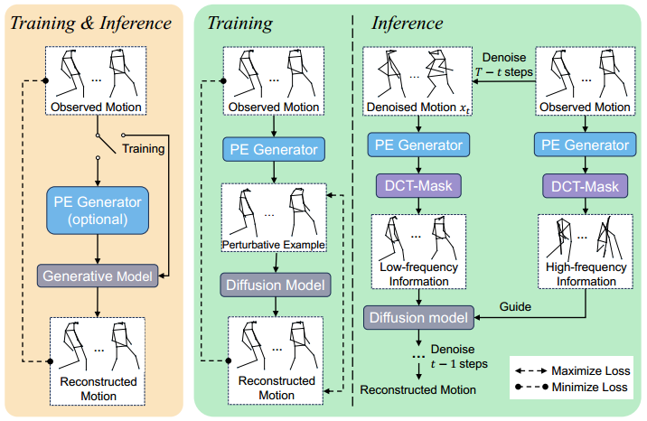
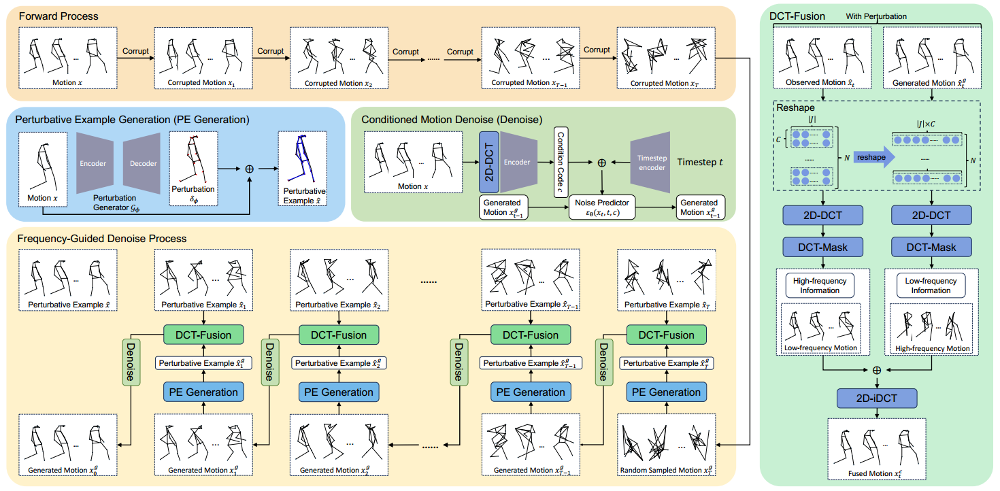
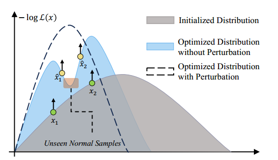
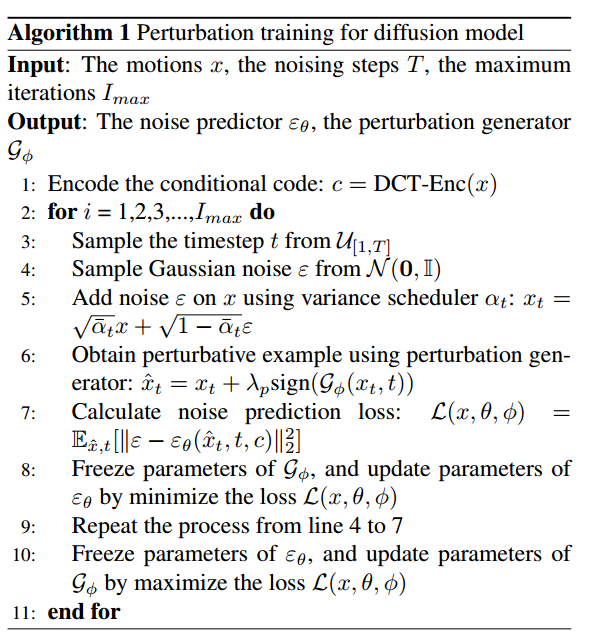
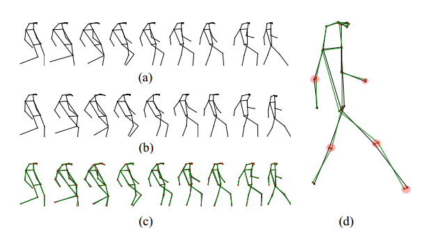
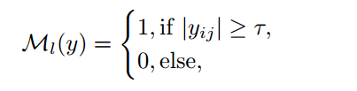

## Frequency-Guided Diffusion Model with Perturbation Training for Skeleton-Based Video Anomaly Detection

**用于骨骼表示的视频异常检测的扰动训练与频率引导扩散模型**

**ques1.** 文章中低频和高频信号的指代问题。低频信号通常对应信号中缓慢变化的趋势或周期性特征，例如人体行走时躯干和下肢的周期性摆动；高频信号反映信号中快速变化的细节或瞬时扰动，例如动作的突然变化。为何 **Introduction** 中认为动作的主体信息和细节信息分别对应高频和低频？( 应该是作者笔误 )

**ques2.** 文章中 **3.1Preliminaries** 中 ``Furthermore, the frequency-guided denoise model generates motions using the low-frequency information from generated motions and supplements the detail using the high-frequency data from observed motions`` 本人翻译为 ``使用生成动作的低频信息生成动作，使用被观察动作的高频信息补充细节`` 。生成动作表示的是扰动生成器生成的还是降噪生成的

**ques3. figure3** 中的 Optimized Distribution 表示什么？对样本进行数据增强后的分布吗？

### Introduction

提出重构建方法比预测类方法效果差的2个原因：

- **缺乏鲁棒性，导致模型将之前从未见过的正常运动错误地分类为异常**

- **现有的重构建方法无法分清动作的主要信息和细节信息，但动作中这两类信息的重构建难度以及对整体任务的贡献相差是很大的**

文章的贡献

- 提出了一种基于重构建的扰动训练模型，通过 **PE生成器** 生成扰动样例，扩散模型在生成的扰动正常动作样例上训练，提高模型的鲁棒性，进一步增强模型对正常和异常动作的可分性
- 研究了一种 **频率引导** 的去噪过程，该过程首先分解运动的频率信息，然后利用观察到的动作高频信息来指导运动的生成（ 在频域上，动作的 **主要信息** 和 **细节信息** 可以被分为 **低频** 和 **高频**  ）

现有基于重构的方法与本文提出的方法的比较。左边（黄色）说明了现有的方法，这些方法重建运动，并将重建误差较大的运动视为异常。特别是，具有输入扰动的方法使用扰动示例（PE）生成器，并且仅在测试阶段使用。右边（绿色）展示了提出的方法。在训练和测试阶段都使用对抗性训练的PE生成器。

在推理过程中，DCTmask获得的频率信息有助于扩散模型鲁棒地重建运动

### Method

#### Preliminaries

提出了一个扰动训练的频率引导扩散模型。首先，动作 $x$ 被破坏，扰动样本 $\hat x$ 由 **PE生成器** ${\cal G}_{\phi}$ 产生。随后，${\cal G}_{\phi}$ 和噪声预测器 ${\varepsilon}_{\theta}$ 交替进行训练。推理阶段，模型将 **生成运动的低频信息** ${\hat x}^{g}_{t}$ 与 **原始运动的高频信息** ${\hat x}^{o}_{t}$ 融合。

#### Diffusion Model with Perturbation Training

##### Effect of Perturbative Motion

由上图，灰色的区域表示初始的样本分布，蓝色的表示未经过扰动的优化后分布，虚线表示经过扰动的优化后分布。

​		为了扩大样本域，需要通过扰动生成一些训练样本中没有的正常动作用例。这些用例 $\hat x_k$ 与原始训练样本中正常动作包含的用例 相似，但表现出相对高的损失值，即生成扰动样本需要找到与原始正常样本相似的且具有相对高损失值的动作，因此本文提出引入一个小的扰动 $\delta$ 以生成一个潜在的正常动作样本 $\hat x_k$ （即扰动样本）

##### Effect of Perturbative Motion

一个可训练的扰动生成器

##### Effect of Perturbative Motion

#### Frequency-Guided Motion Denoise Process

##### Frequency Information in Motion

表示了一个动作中的低频信息与原始动作样本的差异 a) 原始动作；b) 该原始动作的低频信息；c) 二者之间差异；d) 放大差异

##### Frequency Information Extraction

##### Pipeline & Frequency Information Fusion

使用原始运动的高频信息和扩散生成运动的低频信息指导下一轮降噪
