## Interleaving One-Class and Weakly-Supervised Models with Adaptive Thresholding for Unsupervised Video Anomaly Detection

### Contribution

1. 提出了一个新的无监督视频异常检测框架，即交替进行 **单分类模型 ( OCC )** 和 **弱监督模型 ( WS ) ** 的训练

2. 将 **单分类 (OCC) ** 改善为 **加权单分类 (weighted OCC, wOCC)** 使无监督视频异常检测框架训练更稳定；提出了一个**自适应阈值策略**以降低用户交互带来的影响
3. 该框架能灵活应用在不同的 **单分类模型 ** 和 **弱监督模型**  上，在3个单分类模型和2个弱监督模型上的实验证明了该方法的有效性

### Method

#### 	Overview

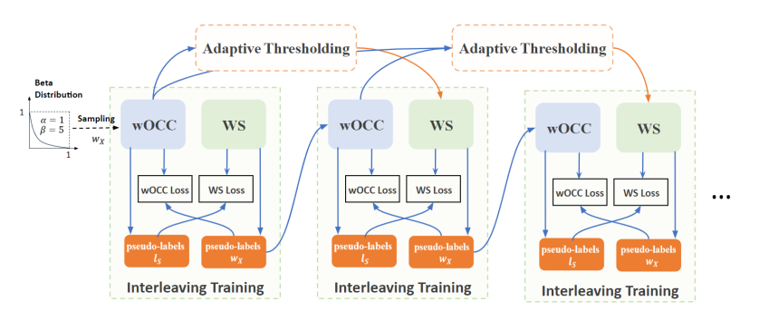

​		方法的基本模块是 **wOCC-WS 交替训练模块** 。这个模块中，每个模型的输出被用作伪标签，用于定义另一个模型的损失函数。一个模块收敛后，重新初始化另一个模块以继续进行交替训练，不同的是其 WS模型 的阈值由基于先前模块中训练的 wOCC模型 的自适应阈值调节机制更新。

​		由于 wOCC 相对于 WS 来说有更稳定的表现，总是初始化 wOCC 以开始训练 **interleaving training模块** 。对于首个模块，进行基于 Beta分布样本 的随机初始化，后续模块使用前一个模块的 WS模型 的结果来进行初始化

#### 	 wOCC-WS Interleaving Training Module

​		模块内，首先1) 初始化 wOCC ；然后2) 使用 wOCC 生成的伪标签训练 WS ；3) WS 生成的伪标签被用于 wOCC 的训练。整个过程不需要人为提示

##### 		wOCC Model ( STG - NF )

​		在本文提出的 UVAD ( 无监督视频异常检测 ) 框架中**直接使用 OCC 可能使得训练出现波动** ( i.e. 模型的表现时好时坏，最终收敛到一个较差的点 ) 。 ``正常样本`` 和 ``异常样本`` 的区分由 0 / 1 的标签来实现，0，1 是硬性二进制标签。训练的过程中，需要鉴别**标签为 0 的样本**（正常样本）来训练 OCC模型，标签可能会直接从 0 和 1 之间突然转化，从而导致用于训练 OCC 模型的正常样本数据频繁变化，这是训练不稳定的来源。

​		文章提出基于软标签的 wOCC ，软标签的取值范围在 [0, 1] 间。相对于硬标签来说，软标签可能会出现从 0.7 到 0.6 的变化，但不会突然变为 0 ，这种一致性降低了交替训练的波动。

​		以 STG - NF 为例，介绍如何将其改善为 wOCC 。原始STG - NF 从训练视频中提取一组对象 $\mathcal X = \{X_1, \cdots, X_i, \cdots\}$ ，其中 $X_i$ 是一个人的动作序列，同时也是 STG - NF 的基本处理单位。原始的STG - NF 最小化**正常数据**的负对数似然

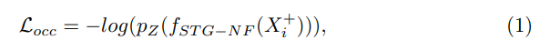

​		其中 $X_{i}^{+} \in \mathcal X^{+}$ 是正常数据样本，$Z = f_{STG-NF}(X_{i}^{+})$ 是 STG - NF 从 $X_{i}^{+}$ 中提取出来的特征，$p_Z$ 是已正常数据已建立的分布 ( the established distribution of the normal data ) 。

​		wOCC 引入软标签 $w_X = \{w_{X_1}, \cdots,w_{X_i}, \cdots\}$ 作为权重来更新 STG - NF ，以监督其对正常和异常数据的训练。对于从 STG - NF 改进的 wOCC ，最小化**所有数据**中的**加权负对数似然**

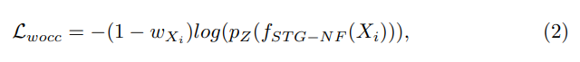

​		其中 $X_i \in \mathcal X$ 表示整个训练集的数据 而不是正常数据样本，软标签 $w_{X_i} \in [0, 1]$  是对象 $X_i$ 表示异常度的权重，软标签值越小表示越属于正常，越容易被 wOCC 学习的分布捕获

##### Pseudo Labels $l_S$ from wOCC

​		用训练好的 wOCC 来生成伪标签 $l_S = \{l_{S_1}, \cdots, l_{S_i}, \cdots\}$ 训练 WS 模型，WS 的基本元素是 "片段" 。首先将训练视频拆分成 片段 ，得到一组 片段 ${\mathcal S} = \{S_1, \cdots, S_i, \cdots\}$ ，需要为每个 片段 $S_i$ 计算标签 $l_{S_i} \in \{0, 1\}$ 。 设 $x_i$ 为 wOCC 对 $X_i$ 计算得到的异常分数，视频片段 $S_i$ 的异常分数通过 片段 内所有对象的异常分数的平均。

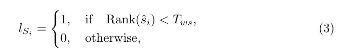

​		对片段根据异常分数进行降序排序，在排列列表中按 $Rank({\hat s_i})$ 获取 $S_i$ 的索引，$T_{ws}$ 是不受具体异常分数影响的相对阈值

##### WS Model ( RTFM )

​		以 ``RTFM`` 为例，无监督方法采用**多示例学习**，根据 片段 级别的伪标签来定义 正袋 和 负袋，一个正袋 $B^+ = {\{{S_i}^+\}^C}_{i=1}$ 包含随机选择的 $C = 16$ 个异常 片段 ，同样，负袋 $B^- = {\{{S_i}^-\}^C}_{i=1}$ 包含随机选择的 $C$ 个正常 片段 。要求 正袋 中 ``the  average Top-k maximum magnitudes of features`` 大于 负袋 。

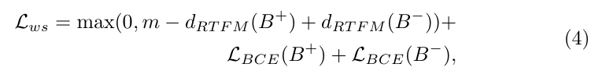

​		其中，$m$ 是边界，$d_{RTFM}(B)$ 返回的是 the  average Top-k maximum magnitudes of features 

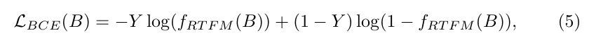

​		其中，$Y$ 是 $B$ 袋 的标签，$f_{RTFM}(B)$ 返回 Top-k 最大异常分数的平均值，$f_{RTFM}(B)$ 和 $d_{RTFM}(B)$ 不一样，前者返回的是异常分数，后者返回的是 the magnitude of the features

##### Pseudo Labels $w_X$ from WS

​		wOCC 训练需要软标签 $w_X$ ，在 WS 中，对象 $X_i$ 的异常分数 ${\hat x}_i$ 就是包含对象 $X_i$ 的片段的异常分数，其软标签 $w_{X_i}$ 为
$$
w_{X_i} = {\hat x}_i
$$
​		其中， ${\hat x}_i$ 已经在 [0,1] 中

##### Initializing the Interleaving Training Module

​		通常训练集中包含的正常样本远远多于异常样本，这意味着大部分的软标签会更接近0而只有少部分软标签接近1，初始化时对 $w_X$ 进行随机的 ``Beta distribution`` 的取样
$$
w_X \sim Beta(\alpha, \beta)
$$
​		其中 $\alpha = 1$ , $\beta = 5$

##### Convergence Analysis

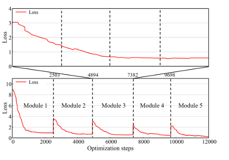

#### Repeating Procedure with Adaptive Thresholding 

​		从头训练新模块中的 wOCC 和 WS 而不是从上一个模块继承模型参数

##### 	Adaptive Thresholding

​		每两个模块之间就有一个 自适应阈值 ，得到一组阈值 $\{T_{ws}^1, T_{ws}^2, \cdots,T_{ws}^i,\cdots\}$ 对应各 interleaving training 模块

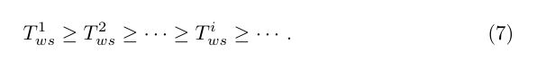

​		从 $T_{ws}^1$ 足够大的值（ 大于最佳阈值 ）开始，其中必然有一个 $T_{ws}^* \in \{T_{ws}^1, T_{ws}^2, \cdots,T_{ws}^i,\cdots\}$ 最接近最佳阈值，而问题在于 **如何强制执行阈值的单调递减** 以及 **如何在最佳点停止重复过程** 

​		首先定义 $T_{ws}^1 = R\% \times N$ ，$R$ 是超参数 ( e.g. $R=30$ ) ，$N$ 是训练集中所有的片段数。这使得 $T_{ws}^1$ 成为一个足够大的阈值，因为通常异常数据的比例在训练集中都少于 30%。

​		令 $M_i$ 为 模块 1 到 模块 i 训练的 wOCC 数量，当为 模块 i+1 ( $i \geq 1$ ) 计算 $T_{ws}^{i+1}$ 时，要考虑所有 $M_i$ 个 wOCC 。特别地，对每个 wOCC （第 $j^{th}$ ，$j \in [1, M_i]$），用其来鉴别训练集中 $R\%$ 的 高异常分数片段，将片段的结果集表示为 $A_j$ ，而后计算所有集合之间的交集，将生成的交集数量计为阈值

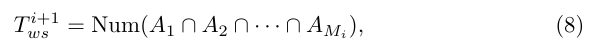

​		其中 $Num(\cdot)$ 计算交集中的元素数。计算交集的这一操作保证了包含的阈值单调递减，本质上，以这种方式计算的阈值是指所有 wOCC 模型都视为异常的片段数。在早期阶段，wOCC 模型的数量很少，因此交集的大小很大，产生的阈值很大。随着涉及的 wOCC 模型越来越多，形成共识变得更加困难，从而产生更小的阈值

##### Stop Criterion

​		目标时找到一个阈值 $T_{ws}^*$ 以最接近最佳阈值。

​		实验发现，$T_{ws}$ 在前几个模块中下降的很快，而后 $T_{ws}$ 的变化变小，这表明 wOCC 达成了关于异常的一种共识，而这种共识的大小就大致表明了异常片段在数据集中的实际数量。

​		基于以上，一旦两个连续交叉训练模块之间的 $T_{ws}$ 变化率小于第一个变化率的 $Q\%$ ，就停止重复过程

##### Training Time Analysis

​		训练过程和原始 wOCC 或者 WS 方法一样快，原因如下：

1.  因为 **Stop Criterion** 交叉训练模块一般重复少于6次就结束了
2.  只训练一个 epoch 的 wOCC ( 或 WS ) ，然后交换到另一个 epoch 训练 WS ( 或 wOCC )

### Experiments

#### Dataset

- STC
- UBnormal

#### wOCC and WS models Employed

##### wOCC

- **AE** 用 AutoEncoder 来重建从视频中提取的特征作为其 OCC 模型
- **Jigsaw** 将视频的时空空间划分为小的立方体，对立方体的位置进行随机排序最后尝试恢复立方体的原始位置
- **STG-NF** 提取人类的姿势序列，构建正常动作序列的多元高斯分布

##### WS

- [**Sultani**](https://arxiv.org/abs/1801.04264) UCF-Crime就是在这里提出的，该模型最大限度提高了包含异常视频片段的正袋和负袋之间的可分性
- **RTFM** 拓展了 [**Sultani**](https://arxiv.org/abs/1801.04264)， 对正袋和负袋之间 Top-k 最大幅度片段进行比较

#### Details

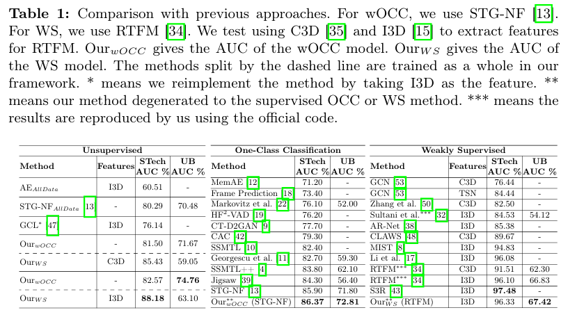

​		** 监督学习代表只在正常数据上学习。中间表格的数据验证了 wOCC 这个策略的有效性；对于WS方法的监督化，允许 WS 模型知道视频级标签，具体来说就是正常视频的片段被视为正常。而由于异常视频的片段可以是正常也可以是异常的，因此他们会通过 **自适应阈值方法** 进行处理

##### Ablation Study

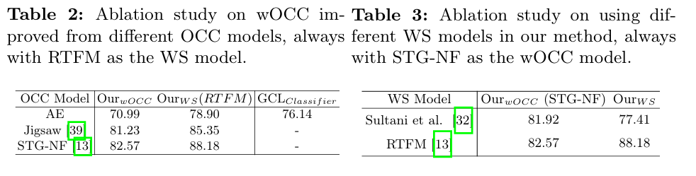

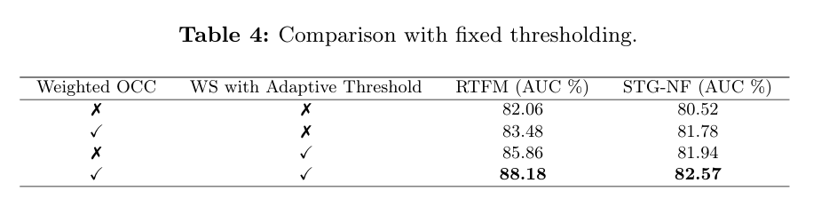