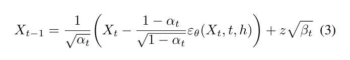

## Multimodal Motion Conditioned Diffusion Model for Skeleton-based Video Anomaly Detection

[papers](https://arxiv.org/abs/2307.07205)

[code](https://github.com/aleflabo/MoCoDAD)

**Video Anomaly Detection**（视频异常检测）任务存在的挑战：

1. 异常定义困难。异常的定义不仅具有高度主观性，而且根据环境和应用的不同也有所不同

2. 异常很少见。异常样本缺失，模型通常只学习常规样本，需要解决数据不均衡问题

3. 异常检测实际上是开放域识别问题，建模异常需要考虑训练集之外的多样性

   

**VAD Techniques**

- **基于潜在表示的视频异常检测（Latent-based VAD）**

  从学习的潜在空间中提取的分数来识别异常，正常的行为会被映射到一个有限的集合中，异常行为会得到一个比较大的分数并且分布在集合外

- **基于重构建的视频异常检测（Reconstruction-based VAD）**

  选取原始的度量空间作为输入，利用重构建作为代理任务以生成错误分数。这些模型训练怎么对输入进行正常行为的编码和重构建，从而在训练过程中没见过的异常更加敏感

- **基于骨骼的视频异常检测（Skeleton-based VAD）**

  使用人类运动的时空骨骼表示，而不是原始视频帧

如今的异常检测方法大部分本质上都是**OCC**（One Class Classification）方法，通过学习大量正常行为特征而判别异常行为。但是存在一个很明显的问题：将正常性强加到受限的集合（训练集中的正样本）这种方法中不适用于多样化但仍然正常的行为，无法有效解决开放域检测问题。

本文提出**MoCoDAD**模型。给定一个动作序列seq，无论是正常行为还是异常行为，将其切割 seq --> (s1, s2)，将未来帧 (s2) 损坏成随机噪声，以第一个过去未被破坏的干净帧（子序列 s1 中最后一帧）为条件，合成被损坏帧的多模态重建。

**MoCoDAD**通过比较多模态分布来区分正常和异常。在正常情况下，**MoCoDAD**生成的运动是多种多样但相关的，即偏向于真正未损坏的帧；异常情况下，合成的运动同样是多种多样的，但是关联程度很低。

亮点：

1. 通过比较正常和异常运动生成的多模态表示来实现VAD任务
2. 首次提出用概率扩散模型实现VAD任务
3. 在正常情况下将合成引导到不同的相关运动 (避免了传统OCC的弊端) 
4. 在UBnormal, HR-UBnormal, HR-STC,  HR-Avenue 4个数据集都取得sota，比原本sota水平分别高5.1%, 4.4%, 0.5%, 0.8%

### Methodology

1）扩散模型降噪训练的过程，如何构造多模态的重构建内容，如何在推理时检测异常	

- **Training**

​		假设有一个单人连续动作序列 ${\bf X} = \{x^1, x^2, ... , x^N\}$，其中每个 $i$ 时刻的动作都能被看成一个图 $x^i = (J, A)$，其中 $J$ 表示关节的集合，$A$ 表示代表关节连接关系的邻接矩阵。值得注意的是，每个关节都有一组空间坐标 ${\mathbb R}^C$ ，因此$x_i \in {\mathbb R}^{|J| \times C}$，${\bf X} \in {\mathbb R}^{N \times |J| \times C}$，C = 2

​		Forward过程中，将运动序列分成两部分 $X^{1:k}$ 和 $X^{k+1:N}$，对于后者，加入随机噪音 ${\varepsilon}^{k+1:N} \in {\mathbb R}^{(N-k) \times |J| \times C}$ 破坏关节位置，随着diffusion timestep逐渐加大对 $x_{t=1} \rightarrow ... \rightarrow x_{t=T}$ 的噪音。

​		Reverse过程中需要通过一个类似于U-Net结构的网络 ${\varepsilon}_{\theta}$ 修复动作损坏，去除噪音 ${\varepsilon}^{k+1:N}$ ，根据diffusion timestep（embedded through an MLP）和 $h$ （对前一段运动序列$X^{1:k}$ embedding得到）训练网络 

​		定义了一个偏差评估对象

​		对其进行平滑处理

- **Inference**

​		推理过程中，MoCoDAD从随机噪音中通过未被破坏的正常帧生成多模态序列特征，随后以统计的方式聚合从而检测异常。

​		对被破坏的序列随机采样，将其视为生成动作特征的重构建过程的起点，通过方程(3)构建

​		需要注意的是 $h$ 对过去的 $k$ 帧进行编码。生成 $m$ 个未来动作 $Z_1,...,Z_m$ ，对每个动作表示 $Z_i$，通过 $s_i = {\mathcal L}_{smooth}(|X - Z_i|)$ 计算重构建错误分数

​		从生成的所有生成的分数 $S = \{s_1,...,s_m\}$ 中提取一个异常分数，随后分配给相应的原始视频正常帧以评估异常。

​		作者还比较了（1）从正常与异常生成之间的差异（2）聚类统计 两种方法提取异常分数

2）用于多模态姿态预测的动作调节信息

​		提出了3种不同的建模选项来调节扩散：input concatenation, E2E-embedding, AE-embedding

​		input concatenation 使用原始输入运动的一部分进行调节，保持过去的动作序列未损坏，将其添加到被损坏的未来的序列中；

​		embedding选项都是指通过encoder $E$ 传递过去帧的信息，然后给到去噪模型的所有潜在层。$E$ 是一个GCN，对$X^{1:k}$ 编码成 $h = E(X^{1:k})$ 。对E2E-embedding（），$E$ 和其他的模块一起通过损失函数 ${\mathcal L}_{smooth}$ 学习；对AE-embedding，添加了一个辅助重构建损失函数 ${\mathcal L}_{rec}$ 来学习$E$ ，通过decoder网络 $D$ 和损失函数基于过去帧的信息进行调节

​		辅助损失函数构成主损失函数的一部分

3）模型结构

​		包含两部分：对未被破坏的动作信息 $X^{1:k}$ 进行建模以得到潜层空间语义信息的Conditioning模块，对 $X^{k+1: N}$ 进行降噪重构建的模型Diffusion

​		Forward Diffusion要做的工作就是估计输入运动中的噪声，重构建实际的动作；Reversed Diffusion采用类似于U-Net网络的结构，对动作的输入序列的空间维度进行收缩后扩展（也就是重构建的过程）；conditioning autoencoder使用了 STS-GCN 来对未被破坏的运动帧进行建模后给到Diffusion，补足时间维度信息

### Experiment

- **和其他OCC方法比较**

​		评价数值为AUC，带 * 的基于骨骼技术

-  **Results VS. Supervised and Weakly Supervised methods**

​		评价数值为AUC，前三个为监督方法，第四个为弱监督方法

### Discussion

- Conditioning

  - input concatenation

    效果不好，原因应该是相对于embedding方法无法有效将过去的运动信息注入网络，并且这会让网络倾向于“记住”这些信息而不是专注于对未来动作进行降噪

  - E2E-embedding

    效果一般，作者认为可能是由于非监督的可学习embedding层导致的，同样不能很好的表示原始动作

  - AE-embedding

    encoder-decoder，通过辅助损失函数 ${\mathcal L}_{rec}$ 训练整个模型

- 对添加噪音的部分的选取

  - in-between imputation

    破坏中间的 $N - k$ 个动作帧，保留起始与结束部分将其放入conditioning部分

  - random imputation

    随机选择 $N-k$ 个不包含完整动作的帧并破坏，其余部分放入conditioning

  - Forecasting

    选定某一处，破坏往后的动作帧，前方的部分放入conditioning

  

- 潜在语义表示（Feeding Diffusion部分）

  

  这部分研究 1）对要加入噪音破坏的序列在未被破坏前先提取潜在语义表示后加入噪音进行破坏 和  2）对要加入噪音破坏的序列直接加入噪音 对模型整体表现的影响

  

  - MoCoDAD + MLD

    使未受噪音破坏的 $X^{k+1:N}$ 经过一个VAE生成一个潜在表示 Z ，用基于transformer的降噪模型对 Z 进行降噪

  - Latent-MoCoDAD

    使用 STS-VAE 学习 Z ，用本文提出的diffusion对其进行降噪

  

  对上述两种方法，将被噪音破坏的 Z 经过一层包含conditioning信息的MLP后进入Reverse Diffusion部分，conditioning部分和原始MoCoDAD保持一致

  

  对要加入噪音破坏的序列直接加入噪音表现更好，作者认为是骨骼表示的轻量级编码的原因

​				