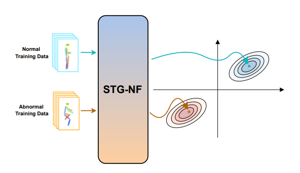

## Normalizing Flows for Human Pose Anomaly Detection

**人体姿态异常检测的标准化流模型**

**from ICCV2023**

**Question**

1. [Permutation处](#ques1)
2. [无向图G =（V，E）中节点 V 是什么](#ques2)

### Introduction

- 针对视频异常检测提出了一种适配**有监督**和**无监督**方法的标准化流结构
- 拓展了标准化流网络以提取人体动作姿态的独特数据
- 在 ShanghaiTech 数据集取得 sota 85.9%，在 UBnormal 取得79.2% 的AUC

### Method

​		给定一个视频序列，使用人体姿势检测器和跟踪器来提取姿势。这些姿势被表示为时空图，并使用标准化流模型嵌入到高斯潜在空间中。最后，根据训练数据评估动作的概率。

#### Normalizing Flows

​		标准化流是一种用于密度估计的无监督模型，定义为从数据空间 $X$ 到潜在空间 $Z$ 的可逆映射 $f$ ： $X \leftrightarrow Z$ 。

​		函数 $f$ 是使用参数 $\theta$ 参数化神经网络实现的：
$$
z = f_{\theta}(x)=g^{-1}_{\theta}(x) \ \ \ \ \ \ \ s.t. \ \ \ x=g_{\theta}(z)
$$
​		$f$ 由一系列变换组成 $f = f_1 \circ f_2 \circ \ldots \circ f_K$ ，像这样的一组可逆转换的序列被称为**标准化流** ，其由神经网络参数化，架构确保雅可比行列式的可逆性和高效计算

​		变换后变量的概率密度如公式1

​		雅可比行列数捕获 $X$ 和 $Z$ 的体积变换

​		基本思想是选择**其雅可比矩阵为三角矩阵**的变换 $f_i$ ，对于这些变换，对数行列式很容易计算，进而可以直接估计概率 $p(x)$

#### Spatio-Temporal Graph Normalizing Flows

​		本文提出的基于标准流的模型学习一个数据分布 $P_X$ 和 潜层高斯分布$P_Z$ 的可逆映射，高斯分布 $Z \sim N(\mu_{normal}, I)$ 位置参数为 $\mu_{normal}$ ，方差为 $I$ 。STG-NF 模块由 $K$ 个步骤组成，每个步骤包含 Actnorm，Permuteation和Spatio-Temporal Affine Coupling 三部分

​		Actnorm 是一个归一化层

​		 Permutaion对输入数据的通道顺序进行排列。做法就是使用可学习的 $1 \times 1$ 卷积层通过线性变换实现可逆的软排列，Permutaion层初始化为随机旋转矩阵 

​		  对输入 $X \in {\Bbb R}^{BCTN}$ ，$B$ 为 batch_size，$C$ 为通道数，$T$ 为段长度，$N$  为节点数。Affine Coupling 将其根据通道分成两部分，其中一半不做改变，另一半根据其做一个仿射变换。这样可以简单的做反向变换和计算雅可比行列式

​		从视频序列（人体关节位置的时间序列）中提取的姿势关键点用无向图 $G$表示，$G = (V,E)$。每个节点$V = \{V_{it} \ | \ t \in [1, \tau],i \in [1, N] \}$ 对应一串有 $N$ 个节点和 $\tau$ 帧的骨骼序列，每条边 $E$ 表示两节点间的某种关系 。使用图卷积，单个通道的输出值如下

​		$N(v_{it})$ 定义了 $v_{it}$ 的连接节点，$w(v_{it}, v_{lm})$ 定义节点之间的连接权重

​		通过最小化训练样本的负对数似然来进行训练

​		对高斯分布 $Z \sim N(\mu_{normal}, I)$ ，得出以下式子来计算 $L_{nll}$

#### Supervised Anomaly Detection

​		本文还讨论了将无监督的标准化流异常检测方法拓展到有监督的设置，做法是用一个高斯混合模型作为 STG-NF 的先验。

​		训练过程中，把一个姿势序列 $X_i$ 映射到密度为 $Z \sim \mathcal N({\mu}_i, I)$ 的潜层表示，$i$ 由姿势序列的标签决定（正常 / 异常），同样通过最小化训练样本的负对数似然来进行训练。为了解决训练样本中异常样本出现概率过低的情况，令 $| \ {\mu}_{normal} \ - \ {\mu}_{abnormal} \ | \gg 0$ ， $f(x_{normal}) \sim \mathcal N(\mu_{normal}, I)$ 概率高， $f(x_{abnormal}) \sim \mathcal N(\mu_{abnormal}, I)$ 概率低

​		推理过程中，和无监督设置用相同的方法通过 $\mu_{normal}$ 来计算正常概率分数（式子4）

### Experiment

​		对模型进行了无监督和有监督方法的实验

#### Dataset

- **ShanghaiTech**

- **UBnormal**

  在ShanghaiTech上进行无监督学习，在UBnormal上分别实验了监督学习和无监督学习

#### Implement Details

##### Data Preprocessing

​		首先使用 AlphaPose 和 YoloX来检测视频帧中的骨骼，然后用 PoseFlow 跟踪视频中的骨骼序列。之后，用滑动窗口方法将每个动作姿态序列划分为固定长度的段，将每个段标准化为零均值和单位方差。推理过程中，对每个段进行评分。对于多个人的帧，对帧中的所有人员采用最低分数（即多人画面中，只要有一人出现异常动作，就算该帧为异常帧）

##### Training

​		对无监督的训练，使用先验 $\mathcal N(3, I)$ 

​		监督训练中，对正常样本使用 $\mathcal N(10, I)$ ，对异常样本使用 $\mathcal N(-10, I)$ 。STG-NF 中使用 8 个 Actnorm，Permuteation和Spatio-Temporal Affine Coupling 的组合

#### Unsupervised

ShanghaiTech-HR 表示ShanghaiTech中只包含人体动作的子集

#### Supervised 

#### Ablation Study

##### Affine Layer

​		将 Affine Layer 中的时空图卷积层换成全连接层，在 ShanghaiTech 中 AUC 从 85.9% 降到 77.0%；换成标准卷积，AUC 降到 78.7%

##### Space-Time

​		以上是 supplementary 中关于 segment 的长度 $\tau$ 对 AUC 的影响（时序关联）

​		作者同样试过降低数据的空间关联，segment长度设为24时，通过使邻接矩阵 $A = I$ （每个关节仅于自身相连）来减少空间上的联系，AUC 从 85.9% 降到 83.9% 

​		由此，作者提出对于 VAD 任务 **时序信息** 远远重要于 **空间信息**

#####  Cross-Dataset Generalization

