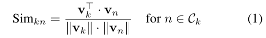
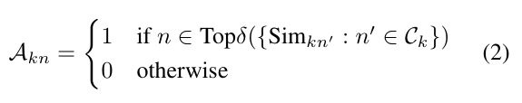
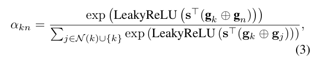
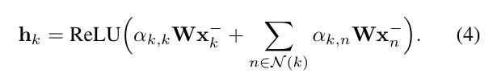
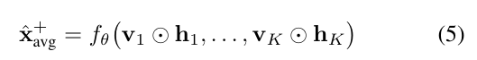
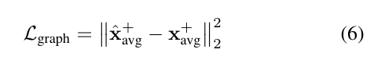
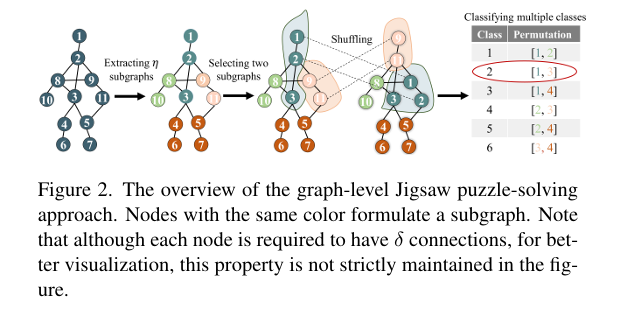
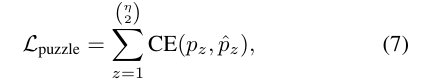
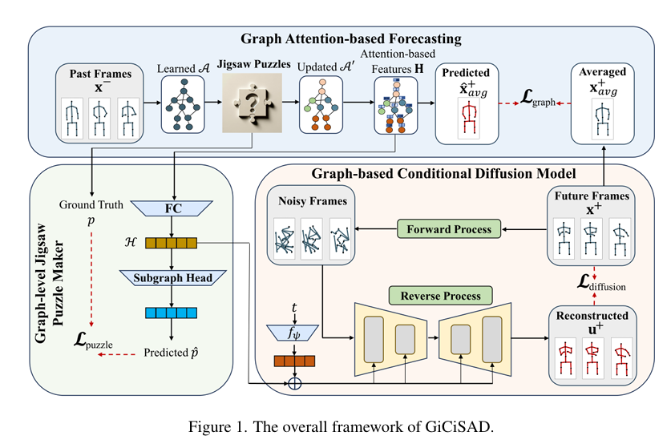

# Graph-Jigsaw Conditioned Diffusion Model for Skeleton-based Video Anomaly Detection

[paper](Graph-Jigsaw Conditioned Diffusion Model for Skeleton-based Video Anomaly Detection)

[code](https://github.com/karami7899/Graph-Jigsaw-Conditioned-Diffusion-Model-for-Skeleton-based-Video-Anomaly-Detection)

和仓库中的 [MoCoDAD](https://github.com/inaomIIsfarell/papers/tree/main/[ICCV2023]MoCoDAD) 非常像

论文提出了三个模块：

1. 基于图注意力的预测模块，捕捉数据中的时空依赖
2. 图级别的 Jigsaw Puzzlw Maker （拼图解谜）模块，区分正常动作和异常动作间区域级的细微区别
3. 基于图的条件扩散模型，生成动作

### Graph Attention-Based Forcasting

把一串完整的动作序列分成两部分 $x^{-}$ 和 $x^{+}$ 分别代表过去帧和未来帧

​	**part.** $\mathcal{A}$ （节点 == 运动特征图中的关节表示）

​		$\mathcal{A} \in \Bbb{R}^{K \times K}$ 是节点的邻接矩阵，$K$ 表示节点的数量。

​		对于节点的特征，用特征向量表示 ${\bf v}_{\mathcal k} \in \Bbb{R}^D, \mathcal k \in \{1,2,\ldots,K\}$ ，$D$ 表示节点特征的维度。特征向量是随机初始化的，和模型其余部分一起训练

​		对 $\mathcal A$ ，其元素 ${\mathcal A}_{kn}$ 表示第 $k$ 个节点和第 $n$ 个节点的特征向量 ${\bf v}_k$ 和第 $k$ 个节点特征向量 ${\bf v}_n$ 之间的关系

​	

​		为了学习 $\mathcal A$ ，首先计算第 $k$ 个节点的特征向量和其他节点 $\mathcal C_k$ （即全部其他节点）的余弦相似度

​		对每个节点 $k$ ，选择前 $\delta$ 高的相似度值作为节点之间连接的判断标准，因此每个节点都和其他 $\delta$ 个节点相连，$\delta$ 是个超参数

​		从节点 $k$ 到节点 $n$ 的连接表明节点 $k$ 的特征向量被用于对节点 $n$ 的行为建模

​	**part.** $\bf H$

​		通过 ``图注意力机制`` 和 $\mathcal A$ 来学习 ${\bf H}, {\bf H} \in {\Bbb R}^{D \times K}$ 

​		$\mathcal A$ 首先要进入 Graph-level Jigsaw Puzzle Maker 模块，模块的输出 ${\mathcal A}^{\prime}$ ， ${\mathcal A}^{\prime}$ 作为图注意力的输入。图注意力机制的目的是通过学习和 permute 图结构（i.e. ${\mathcal A}^{\prime}$ ）来整合节点之间的信息

​		定义节点 $k$ 和节点 $n$ 之间的注意力分数 ${\alpha}_{kn}$ 为

​		其中 ${\bf \tt g}_{k} = {\bf v}_k \bigoplus {\bf W}{{\bf x}_{k}^\bf -}$ ，${\bf W} \in {\Bbb R}^{D \times l}$ ，${{\bf x}_k^-} \in {\Bbb R}^l$ 是第 $k$ 个节点过去帧的输入值 ， $\bigoplus$ 是concat ，${\mathcal N}(k) = \{n|{\mathcal A}^{\prime}_{kn} > 0\}$ 是从 ${\mathcal A}^{\prime}$ 获得的节点 $k$ 的邻居节点集，学习系数的向量用 $\bf s$ 表示 

​		随后获得节点 $k$ 的表示向量

​		随后将每个节点的表示向量  $i.e., \ {\tt \bf h}_k$  和 特征向量 $i.e.,{\bf v}_k$ 进行 **逐元素乘** （ $\bigodot$ ），将其送入 **全连接层** $i.e.,f(\theta)$ ，输出维度为 $K$ ，预测未来帧的平均值，记为 $\hat{\bf x}_{avg}^+$ 

​		通过均方误差损失捕捉身体的整体结构，损失函数 ${\mathcal L}_{graph}$ 如下，${\bf x}_{avg}^+$ 为实际未来动作帧的平均值

​		 $\bf H$ 为过去动作帧的表示矩阵，是所有节点的表示向量的结合 ${\bf H} = \{{\bf h_1}, {\bf h_2},\ldots,{\bf h_K}\}$ ，经过一层全连接层后得到 ${\mathcal H}, {\mathcal H} \in {\Bbb R}^D$ ，用于其他两个模块

### Graph-level Jigsaw Puzzle Maker

​		作者认为正常动作和异常动作之间的细微区别通常可以定位到身体的特定区域，而不是整个身体。提出了自监督学习的 Graph-level Jigsaw Puzzle Maker 方法

​		把 $\mathcal A$ 划分为各子图，$\mathcal A$ 对应整个身体，各子图对应一个单独的身体区域。目标是提取尽可能彼此不同的子图，同时保留同一子图内节点之间的密切关系。使用 ``Girvan-Newman`` 算法在 $\mathcal A$ 中提取 $\eta$ 个子图，各子图的大小（节点个数）不一样，随后在 $\eta$ 子图中选择两个随机交换节点和连接，得到一个 perturbed 的邻接矩阵 ${\mathcal A}^{\prime}$ 

​		在图像级别的拼图解谜方法中，每个“谜题”的定义在所有图像中保持不变，但本文任务涉及学习随时间而变化的邻接矩阵，因此识别的子图是动态的，另外，每个子图中的节点数量的差异会给在子图中 ``shuffle position`` 带来困难。图像级中只shuffle排列puzzle块的位置，图级别中则需要shuffle两个不同大小的子图，改变较大的子图中的内部连接

​		子图 {#1, #2, #3} 和 子图 {#9, #11} 进行 shuffle 后，#1, #2 和 #3 之间的连接被破坏了，但依然属于同一个子图，这是子图内的节点缺乏密切的连接关系的例子。

​		本文作者提出了一个更有效的 shuffle 机制。这个过程中，随机选择两个子图之后通过交换每个子图中连接最密集的节点来启动shuffle过程（ e.g. 交换子图 {#1, #2, #3} 和 子图 {#9, #11} 中的 #2 和 #11 ），节点密度的定义为和同一子图内其他节点的连接数，在计算节点密度时只考虑子图内连接；该过程通过每个子图中下一个最密集的节点相互交换来继续，直到最后一个节点shuffle。优先考虑最密集节点的 shuffle 背后的基本原理是增加它们在 shuffle 后保持连接的可能性。这是因为人们认识到这些密集节点在保持子图的整体结构方面起着至关重要的作用

​		shuffle过后，模型需要进行多分类任务，确定哪两个子图进行了 shuffle，将 $\mathcal H$ 投影到一个全连接层实现的子图头中，输出 $\hat{p}$ ，size为类的数量，和实际进行shuffle的两个子图所表示的类 $p$ 做交叉熵损失

​		                                                           

​		这项任务让模型更好理解身体的每部分区域对正常行为的贡献，实际上每一类的shuffle都可以看作是对正常数据的结构增强形式。虽然这些增强和正常结构有差异，Graph Attention-Based Forcasting 可以初步学习，作者的目标是通过 ${\mathcal L}_{puzzle}$ 对这些结构增强进行分类以减少其他潜空间的影响

### Graph-based Conditional Diffusion Model

和 [MoCoDAD](https://github.com/inaomIIsfarell/papers/tree/main/[ICCV2023]MoCoDAD) 中的 diffusion 模块 基本一致，不想写了

### Overall 

